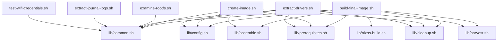

# Technical Summary: Imperative Shimboot Scripts

## Overview

The imperative shimboot scripts located in `/archive/scripts-old/` represent a comprehensive bash-based toolchain for creating custom NixOS images that can boot on ChromeOS devices. These scripts implement an imperative approach to building, assembling, and customizing disk images that combine ChromeOS hardware compatibility with NixOS flexibility.

## Architecture

The script architecture follows a modular design pattern with:

1. **Main entry point scripts** that orchestrate high-level workflows
2. **Library modules** that provide reusable functionality
3. **Utility scripts** for specific tasks like debugging and testing

### Script Dependencies

## Main Scripts

### build-final-image.sh

**Purpose**: Primary build orchestrator that creates the complete shimboot NixOS image.

**Key Functionality**:
- Parses command line arguments for build options
- Sets up logging and cleanup mechanisms
- Checks prerequisites (commands, files, WiFi credentials)
- Builds NixOS raw disk image using `nixos-generate`
- Harvests kernel, initramfs, and modules from ChromeOS shim
- Mounts and assembles the final disk image
- Supports optional recovery image for additional drivers

**Command Line Options**:
- `--recovery`: Use recovery image for additional drivers
- `--systemd-version VERSION`: Lock to specific systemd version
- `--systemd-binary-path PATH`: Manually specify systemd binary path
- `--no-require-patched-systemd`: Don't fail if no patched systemd is found
- `--help, -h`: Show help message

**Build Workflow**:
1. Initialize configuration and parse arguments
2. Set up logging and cleanup traps
3. Check prerequisites
4. Build NixOS raw disk image
5. Harvest components from shim
6. Mount NixOS image
7. Assemble final disk image

### create-image.sh

**Purpose**: Lower-level image creation utility that assembles components into a final disk image.

**Key Functionality**:
- Creates disk image with specified size
- Sets up ChromeOS-style partition table
- Formats partitions appropriately
- Copies bootloader and rootfs data
- Fixes ownership of output file

**Usage**: `./create-image.sh <output_path> <kernel_path> <initramfs_dir> <rootfs_dir>`

### examine-rootfs.sh

**Purpose**: Debugging utility that examines and reports on the structure of built root filesystems.

**Key Functionality**:
- Mounts built shimboot NixOS image
- Examines rootfs structure (files, directories, symlinks)
- Generates detailed report with statistics
- Provides insights into image composition

**Command Line Options**:
- `-i, --image PATH`: Path to image file (default: ./shimboot_nixos.bin)
- `-o, --output PATH`: Path to output report file (default: rootfs-report.txt)
- `-h, --help`: Show help message

### extract-drivers.sh

**Purpose**: Specialized utility for extracting drivers and firmware from ChromeOS shim images.

**Key Functionality**:
- Mounts ChromeOS shim partition
- Extracts `/lib/firmware` and `/lib/modules` directories
- Copies "sacred artifacts" for hardware compatibility
- Supports impure driver extraction workflow

**Usage**: `./extract-drivers.sh <path/to/shim.bin> <output_directory>`

### extract-journal-logs.sh

**Purpose**: Debugging utility for extracting journal logs from user-specified root filesystem devices.

**Key Functionality**:
- Mounts user-specified root filesystem device
- Extracts journal logs from multiple possible locations
- Creates text versions of journal files (head/tail)
- Extracts additional system logs
- Generates comprehensive extraction summary

**Command Line Options**:
- `-d, --device PATH`: Device path (e.g., /dev/sdc4) (required)
- `-o, --output PATH`: Output directory for extracted logs (default: ./journal-logs)
- `-h, --help`: Show help message

### test-wifi-credentials.sh

**Purpose**: Comprehensive testing utility for WiFi credentials setup functionality.

**Key Functionality**:
- Validates WiFi credentials configuration
- Checks required files and their integration
- Tests JSON parsing of credentials
- Validates Nix syntax of related files
- Provides clear status reporting with colored output

**Tests Performed**:
1. Example credentials file existence
2. .gitignore contains wifi-credentials.json
3. WiFi credentials derivation exists
4. WiFi credentials module exists
5. configuration.nix imports the module
6. user-config.nix has WiFi configuration
7. Documentation exists
8. JSON parsing of example file
9. Actual credentials file validation (optional)
10. Nix syntax validation

## Library Modules

### lib/assemble.sh

**Purpose**: Core image assembly functions for creating the final disk image.

**Key Functions**:
- `create_disk_image()`: Creates disk image with specified size
- `partition_disk_image()`: Creates ChromeOS-style partition table
- `setup_image_loop_device()`: Sets up loop device for image
- `format_partitions()`: Formats partitions with appropriate filesystems
- `copy_bootloader()`: Copies bootloader to BOOT partition
- `copy_rootfs()`: Copies NixOS rootfs to ROOTFS partition
- `verify_systemd_patch()`: Verifies systemd binary is patched
- `find_patched_systemd()`: Finds best patched systemd binary
- `create_systemd_symlink()`: Creates systemd init symlink
- `inject_kernel_modules()`: Injects harvested kernel modules
- `inject_firmware()`: Injects harvested firmware
- `inject_modprobe_configs()`: Injects modprobe configurations
- `create_traditional_symlinks()`: Creates compatibility symlinks
- `reset_machine_id()`: Resets machine-id for golden image
- `assemble_final_image()`: Main assembly orchestration function

### lib/cleanup.sh

**Purpose**: Comprehensive cleanup and error handling functions.

**Key Functions**:
- `cleanup_all()`: Cleans up all resources used during build
- `unmount_all()`: Unmounts all mount points
- `detach_all_loop_devices()`: Detaches all loop devices
- `remove_temp_dirs()`: Removes temporary directories
- `setup_cleanup_traps()`: Sets up cleanup traps for graceful exit
- `enable_error_handling()`: Enables error handling with line numbers
- `disable_error_handling()`: Disables error handling for expected failures

### lib/common.sh

**Purpose**: Common utility functions used across all scripts.

**Key Functions**:
- `print_info()`: Prints informational messages (green)
- `print_debug()`: Prints debug messages (cyan)
- `print_error()`: Prints error messages (red)
- `print_warning()`: Prints warning messages (yellow)
- `check_sudo()`: Checks and maintains sudo access
- `keep_sudo_alive()`: Starts background process to keep sudo alive
- `cleanup_sudo()`: Cleans up sudo keepalive process
- `create_loop_device()`: Creates and sets up loop device
- `detach_loop_device()`: Detaches loop device
- `unmount_if_mounted()`: Unmounts filesystem if mounted
- `create_temp_dir()`: Creates temporary directory
- `remove_temp_dir()`: Removes temporary directory
- `log_warnings_and_errors()`: Extracts warnings and errors from log

### lib/config.sh

**Purpose**: Centralized configuration management for all scripts.

**Key Variables**:
- Project paths (shim file, recovery file, kernel file, etc.)
- Partition sizes (in MB)
- Mount points for various filesystems
- Temporary directory paths
- Loop device variables
- Build options (recovery usage, logging)
- Systemd configuration (version lock, patch requirements)
- Required commands and files

**Key Functions**:
- `init_config()`: Initializes configuration with default values
- `print_config()`: Prints current configuration for debugging

### lib/harvest.sh

**Purpose**: Driver and kernel harvesting functions for extracting components from ChromeOS images.

**Key Functions**:
- `harvest_shim_modules()`: Mounts and harvests kernel modules from shim
- `harvest_recovery_drivers()`: Mounts and harvests additional drivers from recovery
- `extract_kernel_partition()`: Extracts kernel partition (KERN-A)
- `extract_initramfs()`: Extracts initramfs from kernel
- `patch_initramfs()`: Patches initramfs with shimboot bootloader
- `harvest_all()`: Main harvesting orchestration function

### lib/nixos-build.sh

**Purpose**: NixOS-specific image building and mounting functions.

**Key Functions**:
- `build_nixos_image()`: Builds NixOS raw disk image
- `mount_nixos_image()`: Mounts NixOS image and extracts rootfs
- `calculate_image_size()`: Calculates required image size based on NixOS image
- `unmount_nixos_image()`: Unmounts NixOS image

### lib/prerequisites.sh

**Purpose**: Prerequisite checking and validation functions.

**Key Functions**:
- `check_not_root()`: Ensures script is not running as root
- `check_root()`: Ensures script is running as root (for specific scripts)
- `check_commands()`: Checks if required commands are available
- `check_files()`: Checks if required files exist
- `check_recovery_file()`: Checks for optional recovery file
- `validate_user_environment()`: Validates user environment
- `check_all_prerequisites()`: Performs comprehensive prerequisite check

## Build Process Workflow

```mermaid
flowchart TD
    A[Start build-final-image.sh] --> B[Initialize Configuration]
    B --> C[Parse Command Line Arguments]
    C --> D[Setup Logging and Cleanup]
    D --> E[Check Prerequisites]
    E --> F[Build NixOS Raw Image]
    F --> G[Harvest Components from Shim]
    G --> H[Extract Kernel Partition]
    H --> I[Extract Initramfs]
    I --> J[Patch Initramfs]
    J --> K[Mount and Harvest Modules]
    K --> L[Mount and Harvest Firmware]
    L --> M[Harvest from Recovery if Enabled]
    M --> N[Mount NixOS Image]
    N --> O[Assemble Final Image]
    O --> P[Create Disk Image]
    P --> Q[Partition Disk Image]
    Q --> R[Setup Loop Device]
    R --> S[Format Partitions]
    S --> T[Copy Bootloader]
    T --> U[Copy Rootfs]
    U --> V[Create Systemd Symlink]
    V --> W[Inject Kernel Modules]
    W --> X[Inject Firmware]
    X --> Y[Inject Modprobe Configs]
    Y --> Z[Create Symlinks and Reset Machine ID]
    Z --> AA[Fix Ownership]
    AA --> AB[Cleanup and Exit]
```

## Key Technical Features

### 1. ChromeOS Compatibility
- Implements ChromeOS-style partition table with STATE, kernel, BOOT, and ROOTFS partitions
- Uses `cgpt` for ChromeOS partition management
- Extracts and preserves ChromeOS kernel and initramfs
- Harvests ChromeOS-specific kernel modules and firmware

### 2. NixOS Integration
- Builds NixOS images using `nixos-generate`
- Maintains NixOS store structure and integrity
- Handles NixOS-specific systemd requirements
- Preserves NixOS declarative configuration benefits

### 3. Hardware Support
- Extracts and preserves original ChromeOS drivers
- Supports optional recovery image for broader hardware compatibility
- Handles firmware injection for various hardware components
- Manages kernel module dependencies and loading

### 4. System Integration
- Implements systemd patching for ChromeOS compatibility
- Creates proper init symlinks and boot process
- Handles machine-id generation for first-boot scenarios
- Manages WiFi credentials integration

### 5. Error Handling and Debugging
- Comprehensive error handling with line number tracking
- Detailed logging at multiple verbosity levels
- Cleanup mechanisms for graceful failure recovery
- Debugging utilities for examining built images and extracting logs

## Configuration Management

The scripts use a centralized configuration system with:

- **Default values** for all configurable parameters
- **Command line overrides** for runtime customization
- **Environment variable support** for integration with other tools
- **Validation** of configuration parameters

Key configuration areas include:
- File paths and locations
- Partition sizing
- Build options (recovery usage, systemd requirements)
- Logging and debugging settings

## Security Considerations

### 1. Privilege Management
- Scripts escalate privileges only when necessary
- Sudo access is maintained through background process
- Cleanup ensures no privileged processes remain

### 2. Temporary File Handling
- Secure temporary directory creation with unique names
- Proper cleanup of temporary files and directories
- No sensitive data left in temporary locations

### 3. WiFi Credentials
- WiFi credentials stored in JSON format
- Credentials file excluded from version control
- Validation of credentials format before use
- Secure handling during image creation

## Limitations and Considerations

### 1. System Dependencies
- Requires specific ChromeOS tools (`cgpt`, `binwalk`)
- Needs NixOS build environment
- Depends on specific systemd versions or patches

### 2. Hardware Compatibility
- Limited to ChromeOS-compatible hardware
- Recovery image recommended for full compatibility
- Some hardware may require additional configuration

### 3. Build Process
- Time-consuming initial build (10-30 minutes)
- Requires significant disk space for intermediate files
- Network connectivity for Nix package downloads

## Migration to Declarative Approach

These imperative scripts represent an earlier approach to shimboot image creation. The current implementation has evolved toward a more declarative Nix-based approach, which offers:

- Better reproducibility
- Easier configuration management
- Improved integration with NixOS ecosystem
- Reduced dependency on external scripts

However, the imperative scripts remain valuable for:
- Understanding the build process in detail
- Debugging complex issues
- Custom scenarios not covered by declarative approach
- Learning about ChromeOS and NixOS integration

## Conclusion

The imperative shimboot scripts provide a comprehensive, well-structured toolchain for creating NixOS images that boot on ChromeOS devices. While the project has evolved toward a more declarative approach, these scripts demonstrate deep understanding of ChromeOS internals, NixOS integration, and the complex interplay between the two systems. The modular design, comprehensive error handling, and debugging utilities make them a valuable reference for understanding the shimboot process and for custom scenarios requiring fine-grained control over the image creation process.