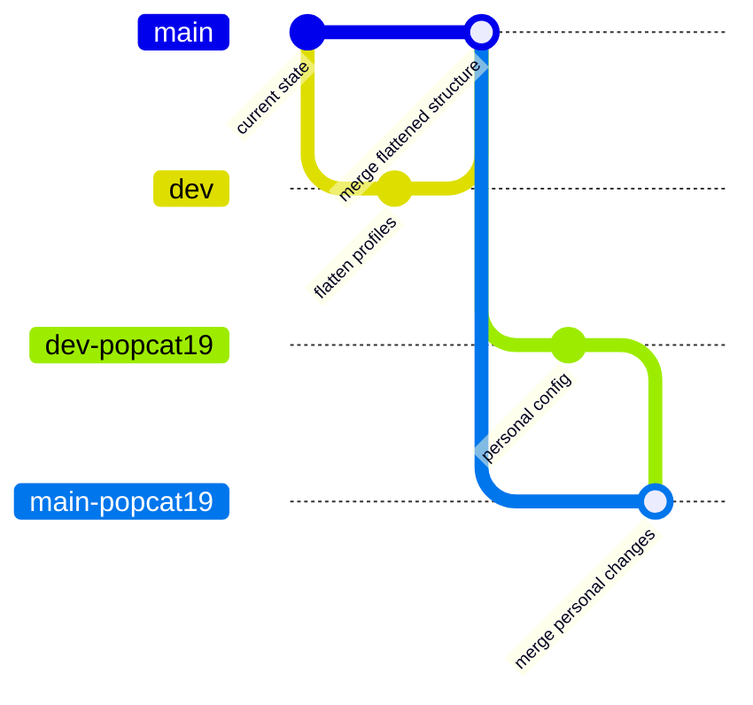

# Profile to Branch Migration Plan

## Problem Statement

Current profile-based architecture causes issues when switching between profiles:
- **Ownership conflicts**: Different usernames (`nixos-user` vs `nixos-popcat19`) cause file ownership issues
- **Home-manager path errors**: Switching profiles breaks home-manager symlinks and user configs
- **Accidental builds**: Easy to accidentally build wrong profile

## Current Architecture

```
shimboot_config/
├── base_configuration/       # Shared system config
└── profiles/
    ├── default/              # General config (username: nixos-user)
    │   ├── user-config.nix
    │   └── main_configuration/
    └── nixos-popcat19/       # Personal config (username: nixos-popcat19)
        ├── user-config.nix
        └── main_configuration/
```

## Recommended Solution: Branch-Based Architecture

### Why Branches Over Profiles

| Aspect | Profiles (Current) | Branches (Proposed) |
|--------|-------------------|---------------------|
| Switching | Requires rebuild, ownership issues | Clean checkout, no conflicts |
| Isolation | Shared repo state | Complete isolation |
| Accidental builds | Easy to build wrong profile | Branch = active config |
| Merge conflicts | Profile drift | Explicit merge process |
| CI/CD | Builds all profiles | Builds only active branch |

### Target Architecture

```
shimboot_config/
├── base_configuration/       # Shared system config (unchanged)
├── main_configuration/       # Flattened from profiles/*/main_configuration/
│   ├── configuration.nix
│   ├── home/
│   └── system/
└── user-config.nix           # Flattened from profiles/*/user-config.nix

flake_modules/
└── system-configuration.nix  # Simplified: no auto-discovery, direct imports
```

### Branch Naming Convention

| Branch | Purpose | Hostname |
|--------|---------|----------|
| `main` | Mainline (general/shared config) | `nixos-user` |
| `dev` | Mainline development/testing | `nixos-user` |
| `main-popcat19` | Personal stable config | `nixos-popcat19` |
| `dev-popcat19` | Personal development/testing | `nixos-popcat19` |

### Branch Strategy



## Migration Steps

### Phase 1: Flatten Profile Structure (on dev branch)

- [ ] Checkout `dev` branch
- [ ] Move `profiles/default/main_configuration/` to `shimboot_config/main_configuration/`
- [ ] Move `profiles/default/user-config.nix` to `shimboot_config/user-config.nix`
- [ ] Delete `profiles/` directory entirely

### Phase 2: Update Flake

- [ ] Remove profile auto-discovery from `system-configuration.nix`
- [ ] Update imports to use `shimboot_config/main_configuration/` directly
- [ ] Update all import paths in `main_configuration/` files

### Phase 3: Merge to Main

- [ ] Merge `dev` into `main` with flattened structure
- [ ] Verify build works on `main`

### Phase 4: Create Personal Branches

- [ ] Create `dev-popcat19` from `dev`
- [ ] Update `user-config.nix` with username `nixos-popcat19`
- [ ] Create `main-popcat19` from `main`
- [ ] Merge `dev-popcat19` into `main-popcat19`

### Phase 5: Document Workflow

- [ ] Document branch switching workflow
- [ ] Document merge strategy for syncing from main/dev to personal branches
- [ ] Update README with new architecture

## Alternative: Single Profile with Multi-User Support

If you prefer keeping one repo/branch, this approach uses a single profile with conditional user config:

```nix
# user-config.nix
{ username ? builtins.getEnv "USER" or "nixos-user", ... }:
{
  user = {
    inherit username;
    # ... rest of config
  };
}
```

Build with: `nixos-rebuild build --argstr username nixos-popcat19`

**Pros:** No branch management, single source of truth
**Cons:** Less isolation, still requires rebuild to switch users

## Decision Required

Which approach do you prefer?

1. **Branch-based (recommended)** - Complete isolation, clean switching
2. **Single profile with conditional** - Simpler repo, less isolation
3. **Hybrid** - Keep profiles but fix ownership issues with proper user migration scripts
